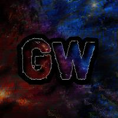

# Galaxy Wars: The Remake

## About
Galaxy Wars: The Remake is a Minecraft server project dedicated to reviving and modernizing the Galaxy Wars minigame, originally created by Hypixel in 2015. This project aims to continue the legacy of this minigame, bringing it back to life with modern Minecraft features and optimizations as well as ongoing updates.

## How to Join
### Server Status
Currently, the Galaxy Wars: The Remake server is in development and will soon be available for closed aplha testing. Check the [discord](https://discord.gg/FzQNJKZMf3) to secure a spot in the testing team and receive the most up to date news.

### Website
Visit our website at: https://gw2-website-v2.vercel.app/

## Game Modes
[Add descriptions of your specific game modes here]

## Development Team
- **Lead Developer**: crazedorangutan
- **Lead Builder**: StellarWombat
- **Game Developer**: sekuia
- **Builder & Web Developer**: Diogo
- **Builder**: Heinzsight
- **Builder**: Urqnox

## Contributing
This is a private project. All rights reserved.

## Community
- [Discord](https://discord.gg/FzQNJKZMf3)
- [YouTube](https://www.youtube.com/@galaxywarsremakeproject9763)

## Credits
- Original Galaxy Wars concept by Hypixel
- Special thanks to all contributors and community members

## License
This project is proprietary software. All rights reserved. See the [LICENSE](LICENSE) file for details.

---
© 2025 Galaxy Wars: The Remake. Not affiliated with Hypixel or Mojang AB.
